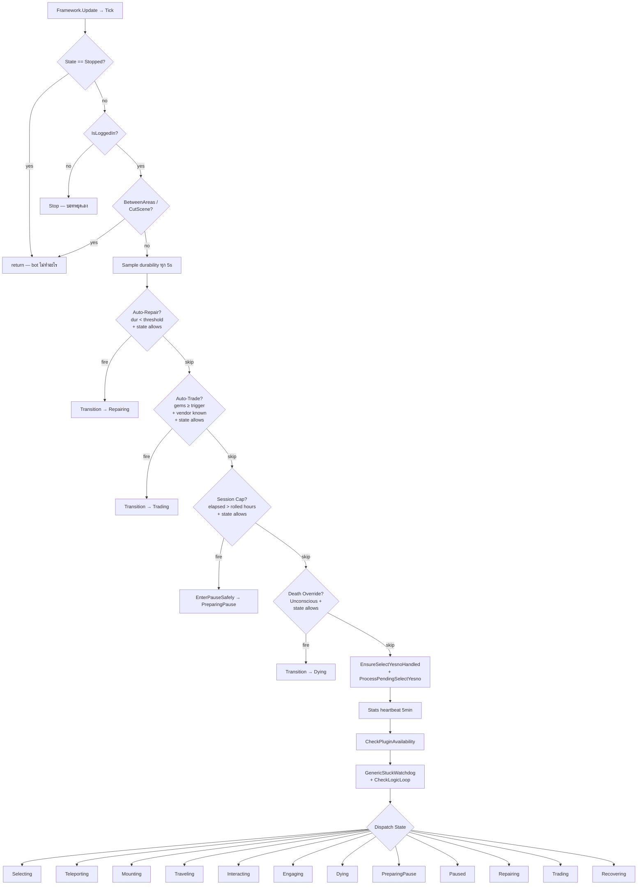
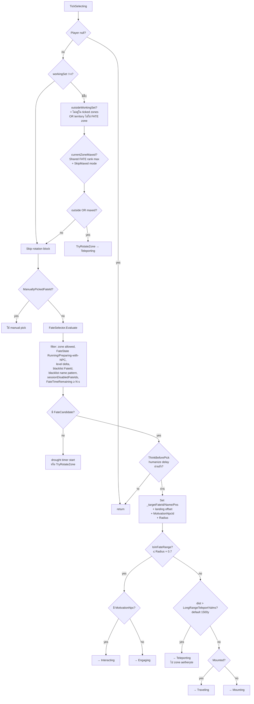
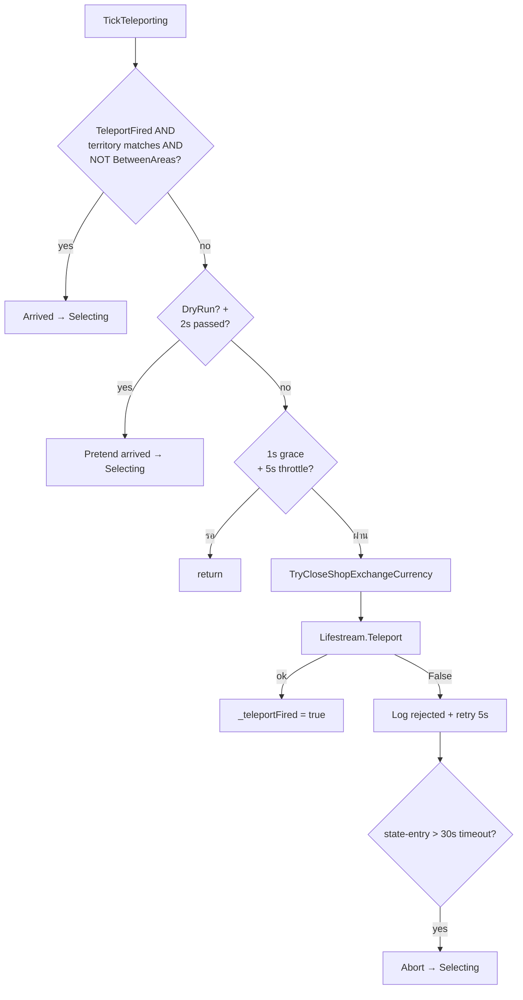
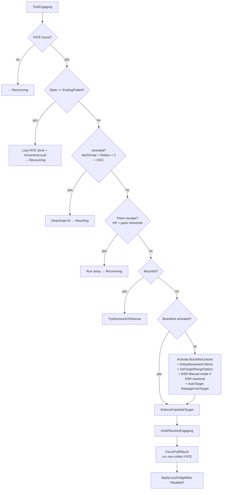
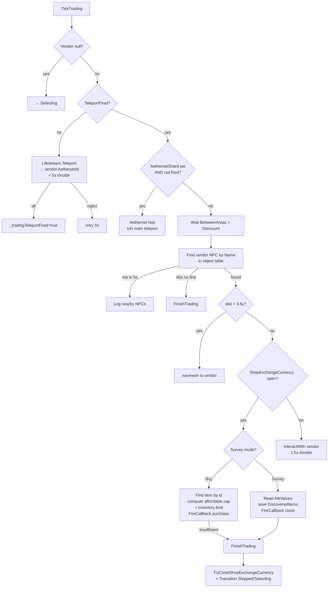
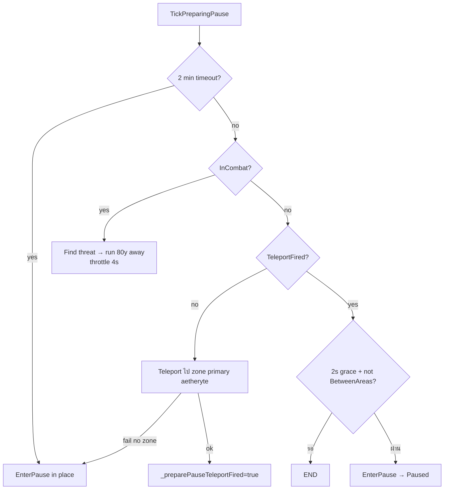
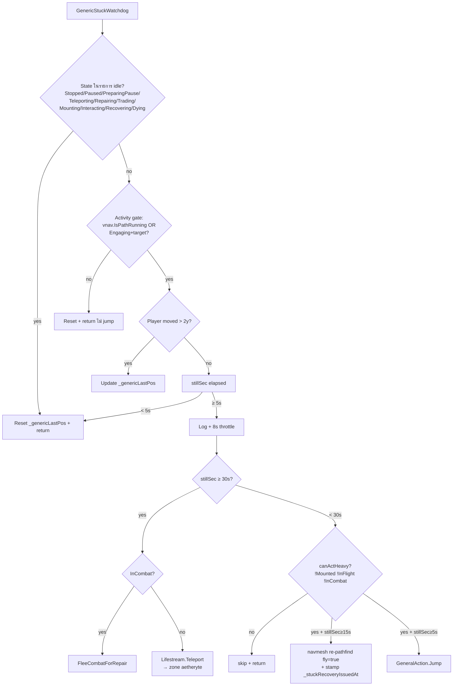
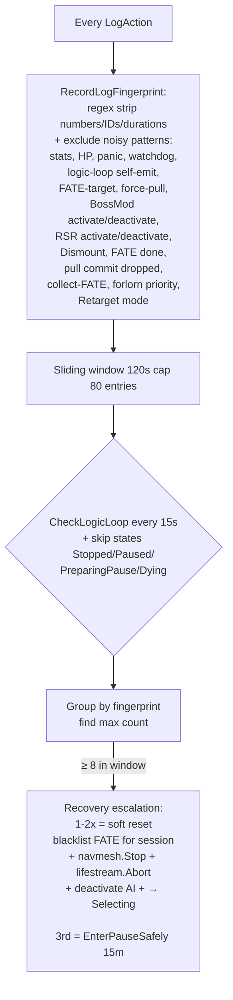
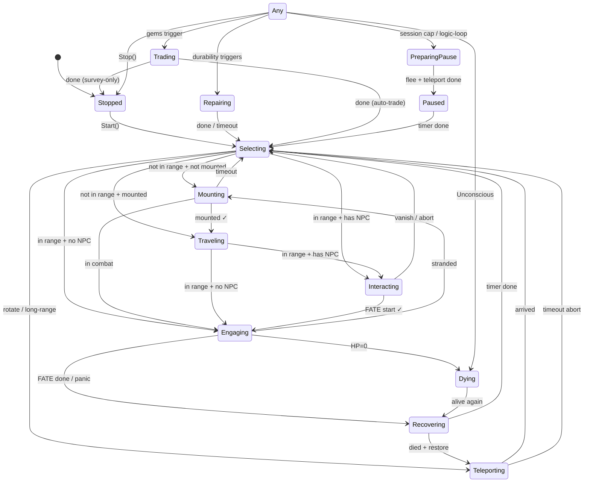

# FateWalker — แผนผังการตัดสินใจ (v1.0.0.30)

อ้างอิงโค้ดจริงจาก `Controller/FateController.cs`. แต่ละกล่องระบุ method ที่เกี่ยวข้องเพื่อตามไปอ่านได้เลย.

---

## 1) Top-level: `Tick()` ทุก frame



### Exclusion lists (ที่ block trigger preempt)

| Trigger | Excluded states |
|---|---|
| **Auto-Repair** | Repairing, Dying, Paused, **PreparingPause**, Teleporting, Interacting, Trading |
| **Auto-Trade** | Trading, Repairing, Dying, Paused, **PreparingPause**, Teleporting, Interacting |
| **Session Cap** | Paused, **PreparingPause**, Dying, **Repairing**, **Trading** |
| **Death Override** | Stopped, Dying เท่านั้น (อย่างอื่นถูก interrupt ได้) |

---

## 2) `TickSelecting` — เลือก FATE ถัดไป



---

## 3) `TryRotateZone` — เลือก zone ถัดไป

```mermaid
flowchart TD
  A[TryRotateZone] --> B{workingSet ว่าง?}
  B -->|yes| Log[Log "tick zones in Zones tab"<br/>+ return false]
  B -->|no| C[Compute urgentRotate =<br/>outside OR not in TerritoryMap OR<br/>currentZone maxed]
  C --> D{urgent?}
  D -->|no| E[Check drought timer<br/>+ humanize hesitate]
  E -->|รอ| END[return false]
  D -->|yes/elapsed| F{Lifestream ready?}
  F -->|no| LOG2[Log + return]
  F -->|yes| G[candidates =<br/>workingSet excl current<br/>+ excl _lastDeparted ถ้า ไม่ urgent<br/>+ excl maxed zones]
  G --> H{candidates ว่าง?}
  H -->|no| I[Pick nextTerritory<br/>round-robin หรือ first ถ้า urgent]
  H -->|yes ครบเงื่อนไข| J{SkipMaxed ON?<br/>+ workingSet.All ติด maxed?}
  J -->|yes| K[**Auto-disable SkipMaxed mode**<br/>+ return false]
  J -->|no| L[Log "no candidate" + return]
  I --> M[Transition → Teleporting<br/>กับ nextTerritory + aetheryte]
```

---

## 4) `TickTeleporting`



---

## 5) `TickEngaging` — สมองหลักของ combat



### `EnforceFateMobTarget` — กลไก targeting

```mermaid
flowchart TD
  A[Throttle 300-1500ms<br/>humanize delay] --> B{Player null?}
  B --> END[return]
  B --> C[isCollect = IsCollectFate]
  C --> D[Read playerBattalion]
  D --> E[Pre-scan: Forlorn Maiden<br/>NameId 6737 หรือ 6738?]
  E -->|มี| FORLORN[Lock target = Forlorn<br/>+ killPhaseLatch=true<br/>+ return]
  E -->|ไม่มี| F[Scan object table<br/>filter: BattleNpc,<br/>not dead,<br/>Combatant,<br/>Hostile flag,<br/>Battalion != player,<br/>FateId == active,<br/>within Radius × 1.5<br/>EXCEPT committed mob]
  F --> G[Partition: aggro<br/>= TargetObjectId == playerId<br/>vs unaggro]
  G --> H{commit valid?}
  H -->|yes| I[Pick commit]
  H -->|no AND grace<4s| J[Return ไม่เปลี่ยน target]
  H -->|no AND grace>4s| K[Drop commit + log]
  I --> L[killPhaseLatch logic:<br/>set true ถ้า aggro≥Max<br/>release ถ้า aggro=0 ต่อเนื่อง 3s]
  K --> L
  L --> M{isCollect AND aggro=0?}
  M -->|yes| COLLECT[clear commit + target = null<br/>+ Retarget=Never<br/>+ return]
  M -->|no| N[Retarget=NoTarget]
  N --> O{stillPulling?<br/>!isCollect AND !killPhaseLatch<br/>AND aggro<Max AND unaggro>0}
  O --> P[Commit aggro'd? drop, pull next]
  O --> Q[Clear-mode safety drop]
  P --> R{พิจารณา}
  Q --> R
  R -->|commit valid| S[Pick commit]
  R -->|stillPulling| T[Pick nearest unaggro]
  R -->|else aggro>0| U[Pick closest aggro<br/>= KILL mode]
  R -->|aggro=0 unaggro=0| V[Log "no mobs" + return]
  S --> W{pick.Id != current target?}
  T --> W
  U --> W
  W -->|yes| X[Set _targetManager.Target<br/>+ log FATE-target]
  W -->|no| END
```

---

## 6) `TickRepairing`

```mermaid
flowchart TD
  A[TickRepairing] --> T1{4 min timeout?}
  T1 -->|yes| AB[Abort → Selecting]
  T1 -->|no| B{Step 1: TeleportFired?}
  B -->|no| C{rejections ≥3 AND InCombat?}
  C -->|yes| FLEE[FleeCombatForRepair<br/>= run 80y from threat]
  C -->|no| D[5s throttle + Lifestream.Teleport<br/>→ Mender aetheryte]
  D -->|ok| TF[_teleportFired=true + reset reject]
  D -->|reject| INC[increment + retry 5s]
  B -->|yes| E[Wait BetweenAreas]
  E --> F{Mounted?}
  F -->|yes| DM[Dismount throttled]
  F -->|no| G[Find Mender NPC by name<br/>in object table]
  G -->|not found 45s| AB
  G -->|found| H{dist > 3.5y?}
  H -->|yes| WALK[navmesh to Mender]
  H -->|no| I[SelectIconString menu<br/>หา "Repair"]
  I --> J[InteractWith Mender]
  J --> K[ใช้ Repair addon callback 4<br/>= Repair All]
  K --> L[SelectYesno auto-confirm<br/>กิล]
  L --> M{durability restored?<br/>>= threshold + 50}
  M -->|yes| BACK[→ Selecting]
```

---

## 7) `TickTrading`



---

## 8) `TickDying` → `TickRecovering`

```mermaid
flowchart TD
  A[TickDying] --> B{Unconscious?}
  B -->|no| REC[→ Recovering]
  B -->|yes| C{Raise received<br/>= rev countdown started?}
  C -->|yes| WAIT[Wait + alive → Recovering]
  C -->|no| D{Raise grace expired<br/>RaiseGraceSeconds?}
  D -->|no| END[return wait]
  D -->|yes| E[Fire GeneralAction Return<br/>= click "Return" dialog]
  E --> F[teleport home aetheryte]
  F --> REC
  REC --> Rec[TickRecovering]
  Rec --> Rec1[Deactivate RSR + BossMod<br/>+ navmesh.Stop]
  Rec1 --> Rec2{died flag?}
  Rec2 -->|yes + zone in workingSet| Tp[Teleport back → Teleporting]
  Rec2 -->|panic flag?| Pan[Wait HP recover]
  Rec2 -->|else| Sel[→ Selecting]
```

---

## 9) `TickPreparingPause` (โหมดกลางหน่วงเข้า Pause)



---

## 10) `GenericStuckWatchdog` — กันค้าง (v1.0.0.28+)



ถ้า InCombat ใน 12s ถัดไป → `_navmesh.Stop()` ให้ BossMod ครองเอง.

---

## 11) `CheckLogicLoop` (anti-loop watchdog)



---

# 🔍 ช่องโหว่ / Edge cases ที่ควรเฝ้าระวัง

## High risk

1. **Dialog ค้างนอก ShopExchangeCurrency**
   - เราปิดเฉพาะ ShopExchangeCurrency. ถ้า Mender repair dialog / SelectIconString / SelectString ยังเปิด → teleport block เหมือนกัน
   - **เสนอ**: เพิ่ม close defensive สำหรับ addon อื่นๆ ที่บ่อย: `SelectYesno`, `SelectString`, `SelectIconString`, `Repair`, `Talk`

2. **TickRepairing 4 min timeout**
   - ถ้า Mender ที่ใกล้ aetheryte ไกล (Living Memory, Mare Lamentorum) bot อาจไปไม่ทันใน 4 นาที → abort → คอนติแบบเดิมจะมีบั๊กไม่ซ่อม → durability ลงเรื่อย → ตาย
   - **เสนอ**: เพิ่ม timeout เป็น 6 นาที / ตามระยะ Mender

3. **`workingSet.Count == 0` (ไม่ติ๊ก zone)**
   - บอท Selecting drought → TryRotateZone fail (no candidates) → log อย่างเดียว
   - ไม่ STOP ตัวเอง ผู้ใช้ไม่รู้ว่าทำไมไม่ฟาร์ม → ค้างไปเรื่อย
   - **เสนอ**: ถ้า working set empty + 60s ไม่ทำอะไร → log error + Stop

4. **Forlorn pre-scan ก่อน Battalion check**
   - Pre-scan ใช้แค่ NameID + FateId, ไม่เช็ค Battalion. ถ้ามี FATE NPC ที่บังเอิญใช้ NameID 6737/6738 (rare แต่ทฤษฎีเป็นได้) → bot ตี friendly NPC
   - **เสนอ**: เพิ่ม Battalion check ใน Forlorn pre-scan

5. **`_killPhaseAggroLossAt` 3s debounce**
   - ถ้า mob ตายเร็วเกินไป (พลังสูง) → ตี mob ตัวเดียวต่อ batch → aggro=1→0 ทันที → 3s debounce → bot รอ 3s โดยไม่ทำอะไร → ดูเฉื่อย
   - **เสนอ**: ถ้า aggro=0 + unaggro=0 (ไม่มีอะไรเหลือ) → release latch ทันที

## Medium

6. **`_pullCommitId` grace 4s**
   - Mob despawn (kill) → grace 4s → bot ยืนรอ 4s ก่อน pick ใหม่
   - ปกติ kill เร็ว → grace ไม่ใช่ปัญหา. แต่ตอน mass kill มี gap
   - **เสนอ**: ลด grace เหลือ 2s ถ้า mob.IsDead == true (รู้ตายแล้ว ไม่ใช่ flicker)

7. **Long-range teleport (1500y threshold)**
   - ถ้า FATE อยู่ไกล 1499y → ไม่ใช้ teleport → บินยาว 75 วินาที
   - **เสนอ**: ลด threshold เหลือ 1000y / เพิ่ม slider config

8. **Retarget mode "Never" ตอน collect**
   - ถ้า mob aggro player ระหว่าง collect → switch กลับ "NoTarget" → BossMod pick + fight
   - แต่ถ้า mob อยู่ไกล → BossMod pick mob ไม่ engage → ค้าง?
   - **เสนอ**: ตรวจสอบ logic flow collect → combat → collect transition

9. **Sec cap timer rolled แค่ตอน Start + Resume**
   - ถ้า bot รัน 4h ครั้งแรก → pause → resume → ปกติ. แต่ถ้า user restart plugin กลางทาง → session timer รีเซ็ตเป็น Start fresh → ไม่เคย pause จริง?
   - **เสนอ**: persist session counters across plugin reload? (อาจ over-engineer)

## Low

10. **No watchdog ใน TickInteracting close-in**
    - ถ้า NPC อยู่ไกล bot walk → ถ้าติดหิน → CheckAndRecoverFromStuck restart navmesh — ก็โอเค
    - **เสนอ**: เพิ่ม timeout เฉพาะ TickInteracting (close-in stall)

11. **Forlorn detection ทุก tick scan O(n)**
    - Scan object table 2 ครั้ง (Forlorn pre-scan + general filter). ใน zone ที่มี actor เยอะ → CPU
    - **เสนอ**: รวม scan เป็นครั้งเดียว, mark Forlorn flag

12. **Stuck recovery teleport ถ้า aetheryte ไม่ attuned**
    - bot stuck → escalate → teleport → fail (not attuned) → re-stuck → loop
    - **เสนอ**: detect rejected teleport ใน watchdog tier 3 → fallback action

---

# 📊 State diagram (summary)



---

# 🧮 Quick reference — thresholds + timers

| Setting | Default | Range / Source |
|---|---|---|
| `MinDroughtSeconds` | 60 (was, slider 10-600) | drought ก่อน rotate |
| `MinLevelDelta` | -12 | FATE level filter |
| `FateTimeRemainingMinSec` | 60 | FATE expiring soon filter |
| `EngageRangeMultiplier` | 0.7 | × radius = "in range" |
| `MaxAggroCount` | 3 | pull size cap |
| `LongRangeTeleportYalms` | 1500 | trigger zone aetheryte teleport |
| `RepairAtDurabilityPercent` | 30 (user 70+) | trigger repair |
| `SessionCapHours` | 4 ± 0.5 jitter | hard pause |
| `SessionCapPauseMinutes` | 30 ± 10 jitter | macro break |
| `RaiseGraceSeconds` | 30 | wait for raise before Return |
| `PanicHpPercent` | 25 (user 40+) | panic-escape trigger |
| Targeting humanize | 300-1500 ms | EnforceFateMobTarget throttle |
| Pull commit grace | 4 s | commit not visible → drop |
| killPhase debounce | 3 s | aggro=0 sustained → release |
| Stuck escalation | 5s/15s/30s | jump / re-path / teleport |
| Logic-loop window | 120s, ≥8 hits | escalate to soft → 3rd = PauseSafely 15m |
| Force-pull throttle | 3 s, 6s OOC | basic-attack to start combat |
| Humanize jump | 25-75s + walking ≥5y/4s | random ground jump |
